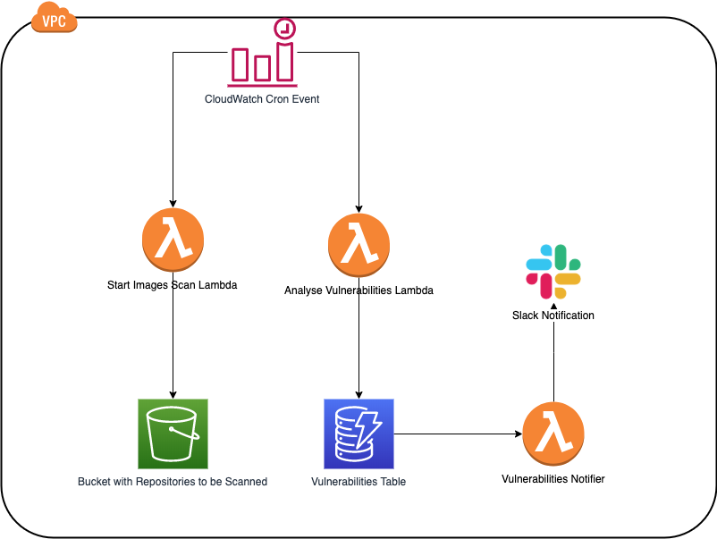

# ecr-scanning

## Pre-Requisites

- Yarn (https://yarnpkg.com/)
- Node.js 10+ (https://nodejs.org/)
- Terraform 12 (https://www.terraform.io/downloads.html)
- A Slack App HTTP Endpoint
- An AWS Account
- Docker images within an ECR Registry

## Overview

This project is meant to scan docker images stored in AWS ECR.

It scans the docker images and analyses the scan results. If there were any vulnerabilities changes or a new image was scanned, the Slack channel injected through the variable `slack_endpoint` is notified.

It uses AWS Lambda Functions to both scan and analyse the ECR images

The diagram below illustrates how it works.



## Configure a Slack App to receive notifications

If you don't yet have a Slack App configured, you can learn how to create one by checking the official [docs](https://api.slack.com/start)

## Define repositories to Scan

You are free to change the `./terraform/ecr-repositories.json` file to match your repositories accordingly. When adding a new repository, all you need is its _name_. Everything else (such as account id, region, etc.) can be left out.

## Deployment

_All the following commands assume you are in the root of the project_

### Deploying Lambda functions and infrastructure

Deployment happens via `terraform`, but you need to generate a .zip file containing the code for the Lambda functions and drop it inside the terraform namespace you are deploying. Terraform will then push this artifact to S3 during deployment.

```bash
./build-scripts/lambda_package.sh ./src terraform/namespaces/default 1.0.0
```
We can finally trigger the deployment with:

```bash
cd ./terraform/namespaces/default
terraform init && terraform apply
```

## Unit tests

Currently, there are tests only for the Lambda functions. Terraform code is not tested at this point.

To run the tests for the Lambda functions, run
```bash
yarn test
```

## Contributing

PRs are more than welcome.

Check [CONTRIBUTING.md](./CONTRIBUTING.md) for more info.

## Philips Forest

This module is part of the Philips Forest.

```
                                                     ___                   _
                                                    / __\__  _ __ ___  ___| |_
                                                   / _\/ _ \| '__/ _ \/ __| __|
                                                  / / | (_) | | |  __/\__ \ |_
                                                  \/   \___/|_|  \___||___/\__|  

                                                                 Infrastructure
```

Talk to the forestkeepers in the `forest`-channel on Slack.

[](https://philips-software-slackin.now.sh)